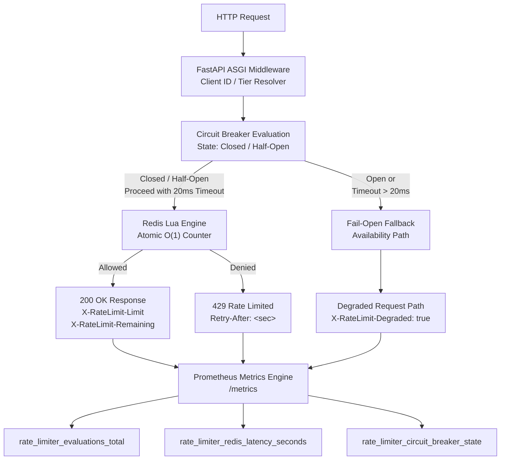

# Distributed API Rate Limiter

A production-grade, distributed rate-limiting service built with **Python (FastAPI)**, **Redis**, and **Docker**.

Engineered with senior-level system design patterns, it implements an **O(1) memory Sliding Window Counter** using atomic Redis Lua scripting, an integrated **fail-open circuit breaker** with strict latency budgets, and end-to-end **Prometheus observability**.

---

## Architecture Overview



---

## Core Technical Highlights

* **O(1) Sliding Window Counter:** Avoids the unbounded memory overhead of Sorted Sets (`ZSET` O(N)) by interpolating counts between current and previous discrete time buckets inside an atomic Lua script.

* **Fail-Open Resilience:** Enforces a strict 20ms execution deadline. If Redis encounters high latency, node failure, or network partitions, traffic gracefully degrades with `X-RateLimit-Degraded: true` instead of causing cascading `500` errors.

* **Race-Condition Free:** Full state transitions, count increments, and TTL bounds are evaluated atomically inside Redis through a single Lua execution.

* **RFC-Compliant Headers:** Serves `X-RateLimit-Limit`, `X-RateLimit-Remaining`, `X-RateLimit-Window`, and `Retry-After`.

* **Telemetry & SLI Tracking:** Built-in Prometheus instrumentation tracks evaluation status distributions (`allowed`, `blocked`, `fail_open`), Redis latency histograms, and circuit breaker states.

---

## Architectural Decisions & Trade-Offs (ADR)

### 1. Sliding Window Counter vs. Sliding Log (`ZSET`)

#### Sliding Log (`ZSET`)

Stores a unique timestamp for every request.

* Memory consumption grows with request volume: **O(N)**
* Higher memory usage under heavy traffic
* Susceptible to Redis Out-Of-Memory (OOM) conditions during flood attacks
* Provides precise request timestamps

#### Sliding Window Counter — Chosen

Approximates request volume by weighting the previous window against elapsed time:

$$
\text{Estimated Count}
=
\text{Count}_{prev}
\times
\left(
1 -
\frac{\text{Elapsed Time}}{\text{Window}}
\right)
+
\text{Count}_{curr}
$$

This maintains **O(1) memory per client key** while reducing boundary burst anomalies.

---

### 2. Availability (Fail-Open) vs. Strict Enforcement (Fail-Closed)

In a core API infrastructure path, rate-limiter latency directly affects application response times, particularly `p99` latency.

#### Fail-Closed

* Protects upstream compute resources
* Preserves strict rate-limit enforcement
* Redis outages can prevent legitimate requests from reaching upstream services

#### Fail-Open — Chosen

* Prioritizes customer availability
* Allows traffic to continue when Redis is unavailable or exceeds the latency budget
* Exposes degraded operation through `X-RateLimit-Degraded: true`
* Enables SRE alerting through Prometheus metrics

---

### 3. Redis Cluster Compatibility (Hash Tagging)

To ensure atomic Lua execution across distributed Redis Cluster nodes, rate-limiter keys utilize **Redis Hash Tags**:

```text
rl:{tenant_12345}:1726484100
rl:{tenant_12345}:1726484160
```

The `{tenant_12345}` hash tag forces all related time-window buckets to land on the **same Redis shard slot**, avoiding `CROSSSLOT` errors during atomic operations.

---

## Project Structure

```text
distributed-rate-limiter/
├── app/
│   ├── __init__.py
│   ├── circuit_breaker.py   # Circuit breaker state engine & fail-open logic
│   ├── config.py            # Environment-driven settings (pydantic-settings)
│   ├── limiter.py           # O(1) Redis Lua sliding window algorithm
│   ├── main.py              # Application entrypoint & ASGI lifecycle
│   ├── metrics.py           # Prometheus instrumentation & metrics endpoint
│   └── middleware.py        # ASGI rate-limiting middleware & header injector
├── tests/
│   ├── __init__.py
│   └── test_limiter.py      # Async integration tests with pytest
├── load_testing/
│   └── locustfile.py        # High-concurrency load & burst simulation
├── docker-compose.yml
├── Dockerfile
├── requirements.txt
└── README.md
```

---

## Quick Start

### 1. Run via Docker Compose

Start both the FastAPI service and an isolated Redis container:

```bash
docker compose up --build -d
```

Check the application health:

```bash
curl http://localhost:8000/health
```

---

### 2. Manual Local Setup

Create and activate a virtual environment:

```bash
python -m venv venv
source venv/bin/activate
```

Install dependencies:

```bash
pip install -r requirements.txt
```

Run the FastAPI application:

```bash
uvicorn app.main:app --host 0.0.0.0 --port 8000 --reload
```

---

## Testing & Benchmarks

### Automated Test Suite

The automated test suite includes validation for:

* Quota consumption
* Rate-limit enforcement (`HTTP 429`)
* Exempt-path bypasses
* State reset behavior
* Concurrent request handling

Run the test suite:

```bash
pytest tests/ -v
```

---

### Concurrency Load Testing with Locust

Run the load-testing suite to inspect **p95/p99 latency** and verify `429` response distributions under concurrent load:

```bash
locust -f load_testing/locustfile.py --host=http://localhost:8000
```

Open the Locust dashboard:

```text
http://localhost:8089
```

---

## Observability & Metrics

Prometheus metrics are exposed directly through:

```http
GET /metrics
```

### Available Metrics

| Metric Name                          | Type      | Description                                                                |
| ------------------------------------ | --------- | -------------------------------------------------------------------------- |
| `rate_limiter_evaluations_total`     | Counter   | Rate-limit checks partitioned by status: `allowed`, `blocked`, `fail_open` |
| `rate_limiter_redis_latency_seconds` | Histogram | Redis evaluation latency across configured buckets                         |
| `rate_limiter_circuit_breaker_state` | Gauge     | Current circuit state: `0` = Closed, `1` = Half-Open, `2` = Open           |

### Key Operational Signals

The metrics provide visibility into:

* Rate-limit decisions
* Redis latency
* Fail-open events
* Circuit breaker transitions
* Request enforcement behavior
* System degradation during Redis failures

```
```
